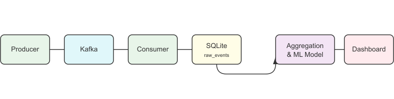

# Game Events Analytics Pipeline

## Project Description

This project is an end-to-end data pipeline that simulates the collection, processing, storage, and analysis of events from a mobile game. The pipeline is orchestrated using Apache Airflow and includes a machine learning component that predicts player churn.

## Architecture



## Technologies

| Component          | Technology             |
|--------------------|------------------------|
| Orchestration      | Apache Airflow         |
| Data Streaming     | Apache Kafka           |
| Containerization   | Docker, Docker Compose |
| Database           | SQLite                 |
| ETL/Analytics      | Pandas                 |
| Machine Learning   | Scikit-learn           |
| Visualization      | Streamlit              |

## How to Run the Project

### Prerequisites

- Docker and Docker Compose
- Python 3.8+

### Steps to Run

1.  **Clone the repository:**
    ```bash
    git clone [https://github.com/your-username/your-repo.git](https://github.com/your-username/your-repo.git)
    cd your-repo
    ```

2.  **Build and run the Docker containers:**
    This command will start Airflow, Kafka, and all other services.
    ```bash
    docker-compose up --build -d
    ```

3.  **Access the Airflow UI:**
    Open a browser and go to `http://localhost:8080`. Log in with `airflow` / `airflow`.

4.  **Run the DAG:**
    In the Airflow UI, enable (un-pause) the `game_events_pipeline` DAG and trigger it manually.

5.  **Run the Dashboard:**
    After the DAG has run successfully, start the Streamlit dashboard in a new terminal:
    ```bash
    pip install -r requirements.txt
    streamlit run dashboard.py
    ```
    *(Note: The `pip install` command installs the necessary libraries for Streamlit in your local Python environment, separate from Docker.)*