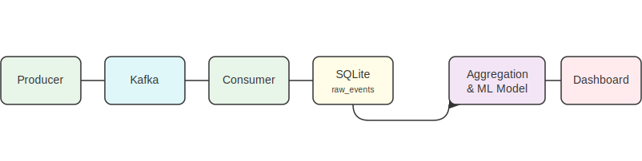

# Game Events Analytics Pipeline

## Opis projekta

Ovaj projekat je end-to-end data pipeline koji simulira prikupljanje, obradu, skladištenje i analizu događaja iz mobilne igre. Pipeline je orkestriran pomoću Apache Airflow-a i uključuje i komponentu za mašinsko učenje koja predviđa odliv igrača (churn).

## Arhitektura



## ⚙️ Tehnologije

| Komponenta         | Tehnologija           |
|--------------------|------------------------|
| Orkestracija       | Apache Airflow         |
| Streaming          | Apache Kafka           |
| Kontejnerizacija   | Docker, Docker Compose |
| Baza podataka      | SQLite                 |
| ETL/Analitika      | Pandas                 |
| Mašinsko učenje    | Scikit-learn           |
| Vizualizacija      | Streamlit              |

## Kako pokrenuti projekat

### Preduslovi

- Docker i Docker Compose
- Python 3.8+

### Koraci za pokretanje

1.  **Klonirajte repozitorijum:**
    ```bash
    git clone [https://github.com/tvoje-ime/tvoj-repo.git](https://github.com/tvoje-ime/tvoj-repo.git)
    cd tvoj-repo
    ```

2.  **Izgradite i pokrenite Docker kontejnere:**
    Ova komanda će podići Airflow, Kafku i sve ostale servise.
    ```bash
    docker-compose up --build -d
    ```

3.  **Pristupite Airflow UI:**
    Otvorite pretraživač i idite na `http://localhost:8080`. Ulogujte se sa `airflow` / `airflow`.

4.  **Pokrenite DAG:**
    U Airflow UI, omogućite (un-pause) `game_events_pipeline` DAG i pokrenite ga ručno.

5.  **Pokrenite Dashboard:**
    Nakon što se DAG uspešno izvrši, pokrenite Streamlit dashboard u novom terminalu:
    ```bash
    pip install -r requirements.txt
    streamlit run dashboard.py
    ````
